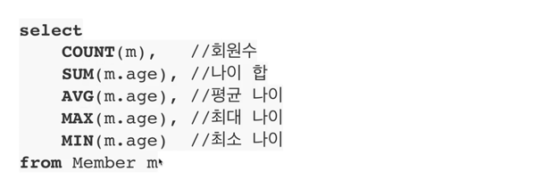
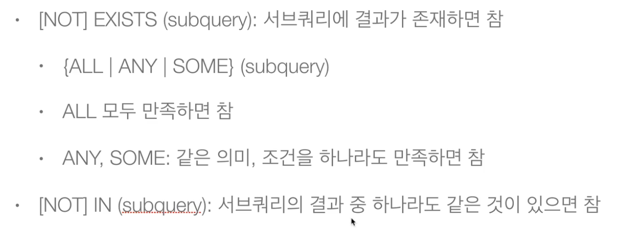

# JPQL

## JPQL 소개
- 객체지향 쿼리 언어이다.
- 엔티티 객체를 대상으로 쿼리한다.
- SQL을 추상화해서 특정 데이터베이스 SQL에 의존하지 않는다.
- 결국 SQL로 변환된다.

## JPQL 문법
- select m from Member as m where m.age > 18
- Entity와 속성은 대소문자 구분한다. (Member, age)
- JPQL 키워드는 대소문자 구분하지 않는다. (SELECT, WHERE, where)
- Entity 이름을 사용한다. (테이블 이름 X)
- 별칭은 필수이다. (m, as는 생략 가능)

## 집합과 정렬

## TypeQuery, Query

### TypeQuery
- 반환 타입이 명확할 때 사용한다.

### Query
- 반환 타입이 명확하지 않을 때 사용한다.

## 결과 조회 API

### query.getResultList()
- 결과가 하나 이상일 때 리스트를 반환한다.
- 결과가 없으면 빈 리스트를 반환한다.

### query.getSingleResult()
- 결과가 정확히 하나일 때 단일 객체를 반환한다.
- 결과가 없으면, NoResultException 예외가 발생한다.
- 결과가 둘 이상이면, NonUniqueResultException 예외가 발생한다.

# 프로젝션

- SELECT 절에 조회할 대상을 지정하는 것
- 프로젝션 대상: 엔티티, 임베디드 타입, 스칼라 타입(숫자, 문자 등 기본적인 데이터 타입)

## 여러 값 조회
1. Query 타입으로 조회
2. Object[] 타입으로 조회
3. new 명령어로 조회
₩₩₩
List<MemberDTO> result = em.createQuery("select new jpql.memberDTO(m.username, m.age) from Member m", MemberDTO.class)
   .getResultList();
MemberDTO memberDTO = result.get(0);
₩₩₩

## 페이징
₩₩₩
em.createQuery("select m from Member m order by m.age desc", Member.class)
   .setFirstResult(0)
   .setMaxResults(10)
   .getResultList();
₩₩₩

## 서브쿼리

### 서브쿼리 지원 함수

### JPA 서브 쿼리 한계
- FROM 절의 서브 쿼리는 현재 JPQL에서 불가능하다. (> 조인으로 풀 수 있으면 조인으로 해결)