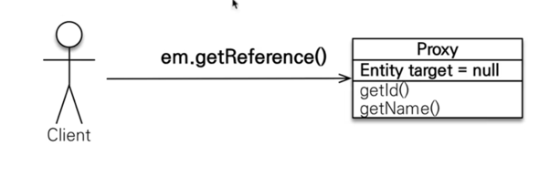
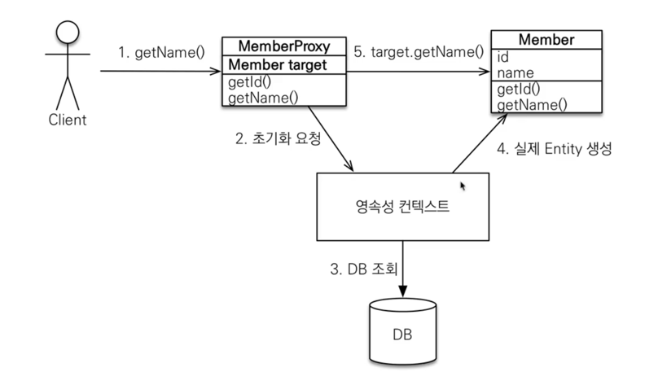
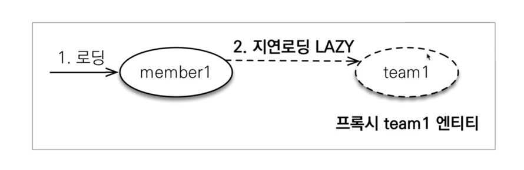
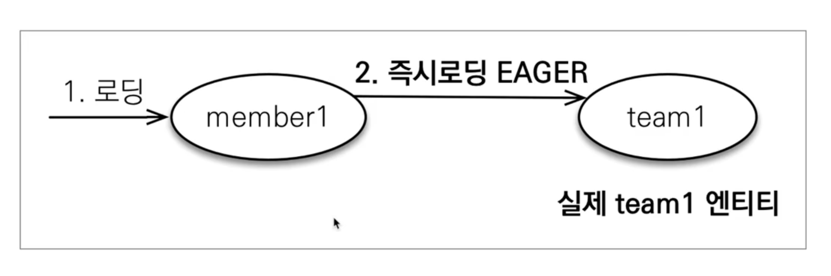
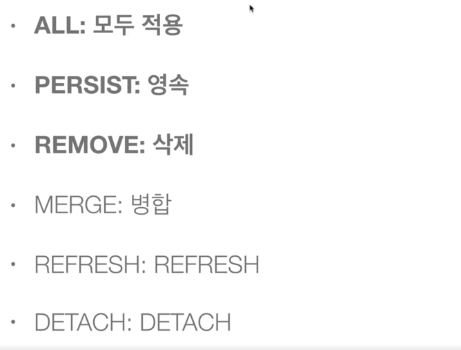

# 프록시

## 프록시 기초

### em.find()
데이터베이스를 통해서 실제 엔티티 객체 조회

### em.getReference()
데이터베이스 조회를 미루는 가짜(프록시) 엔티티 객체 조회 (쿼리 호출 X)



## 프록시 특징
- 처음 사용할 때 한 번만 초기화 된다.
- 초기화 할 때 프록시 객체가 실제 엔티티로 바뀌는 것이 아니고, 프록시 객체를 통해서 실제 엔티티에 접근이 가능해지는 것이다.
- 원본 엔티티를 상속 받기 때문에, 타입 체크 시 주의해야 한다. (== 비교 x, instance of 사용 )
- 영속성 컨텍스트에 찾는 엔티티가 이미 있을 때, em.getReference()를 호출해도 실제 엔티티가 반환된다. (반대도 마찬가지)
- 영속성 컨텍스트의 도움을 받을 수 없는 준영속 상태일 때, 프록시를 초기화 할 수 없다. (시도하면 에러 발생)

## 프록시 객체의 초기화


<br/>

# 즉시 로딩과 지연 로딩

## 지연 로딩 (LAZY)

실제 객체(team)을 사용하는 시점에 초기화 (데이터베이스 조회)

## 즉시 로딩 (EAGER)

객체를 같이 쓰는 경우가 많으면, 즉시 로딩으로 가지고 오는 것이 유리하다. (join)

## 프록시와 즉시 로딩 주의
- 가급적 지연 로직만 사용한다.
- 즉시 로딩을 적용하면 예상하지 못한 SQL이 발생한다.
- 즉시 로딩은 JPQL에서 N+1 문제를 일으킨다.
- @ManyToOne, @OneToOne은 기본적으로 즉시 로딩이므로, 지연 로딩으로 정의해주어야 한다.
- @OneToMany, @ManyToMany은 기본적으로 지연 로딩이다.

## 지연 로딩 활용
- 자주 함께 사용하면? > 즉시 로딩
- 가끔 함께 사용하면? > 지연 로딩
- 하지만 실무에서는 모두 LAZY로 설정해주어야 한다.

<br/>

# 영속성 전이 (CASCADE)
```
@OneToMany(mappedBy = "parent", cascade = CascadeType.ALL )
List<Child> children = new ArrayList<>();
```
특정 엔티티를 영속 상태로 만들고 싶을 때 연관된 엔티티도 함께 영속 상태로 만들고 싶을 때 사용한다.

## 영속성 주의
- 영속성 전이는 연관관계를 매핑하는 것과 아무 관련이 없다.
- 엔티티를 영속화할 때 연관된 엔티티도 함께 영속하는 편리함을 제공할 뿐이다.

## CASCADE 종류


<br/>

# 고아 객체
- 고아 객체 제거: 부모 엔티티와 연관관계가 끊어진 자식 엔티티를 자동으로 삭제한다.
- orphanRemoval= ture

## 고아 객체 주의
- 참조가 제거된 엔티티는 다른 곳에서 참조하지 않는 고아 객체로 보고 삭제하는 기능
- 참조하는 곳이 하나일 때만 사용해야 한다.
- 특정 엔티티가 개인 소유할 때 사용한다.
- @OneToOne, @OneToMany 만 가능하다.

