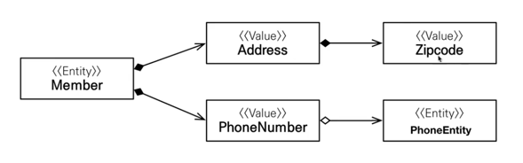
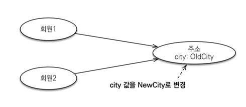
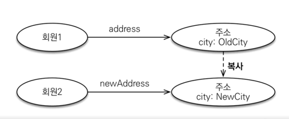

## JPA 데이터 타입 분류

### 엔티티 타입
- @Entity 로 정의하는 객체
- 데이터가 변해도 식별자로 추적 가능

### 값 타입
- int, Long, boolean 등 단순히 값으로 사용하는 자바 기본 타입이나 객체
- 식별자가 없고 값만 있으므로 변경 후 추적 불가능

## 값 타입 분류

### 기본값 타입
- String, int, boolean
- 생명주기를 엔티티에 의존한다.
- 값 타입은 공유하면 안된다.

### 임베디드 타입 (복합값 타입)
- 새로운 값 타입을 직접 정의할 수 있다.
- JPA는 임베디드 타입이라고 한다.
- 주로 기본값 타입을 모아 만들어서 복합값 타입이라고도 한다.
- int, String과 같은 값 타입이다.

### 임베디드 타입 사용법
- @Embeddable : 값 타입을 정의하는 곳에 표시한다.
- @Embedded : 값 타입을 사용하는 곳에서 표시한다.
- 기본 생성자는 필수이다.

### 임베디드 타입과 테이블 매핑
- 임베디드 타입은 엔티티의 값일 뿐이다.
- 임베디드 타입을 사용하기 전과 후의 매핑하는 테이블은 같다.
- 객체와 테이블을 세밀하게 매핑하는 것이 가능해진다.
- 잘 설계한 ORM 어플리케이션은 매핑한 테이블의 수보다 클래스의 수가 더 많다.

### 임베디드 타입과 연관관계

### @AttributeOverride: 속성 재정의
- 한 엔티티에서 같은 값 타입을 사용한다. > 칼럼명이 중복된다.
- @AttributeOverrides와 @AttributeOverride를 사용해서 칼럼명 속성을 재정의한다.

### 값 타입 공유 참조
- 임베디드 타입 같은 값 타입을 여러 엔티티에서 공유하면 위험하다.
- 부작용이 발생할 수 있다.

### 값 타입 복사
- 값 타입의 실제 인스턴스 값을 공유하는 것은 위험하다.
- 대신 값을 복사해서 사용해야 한다.

### 불변 객체
- 객체 타입을 수정할 수 없게 만들면 부작용을 막을 수 있다.
- 값 타입은 불변 객체로 설계해야 한다.
- 불변 객체: 생성 시점 이후 값을 변경할 수 없는 객체
- 생성자로만 값을 설정하고 수정자(setter)를 만들지 않는다.

### 값 타입의 비교
- 동일성 비교: 인스턴스의 참조 값을 비교한다. (==)
- 동등성 비교: 인스턴스의 값을 비교한다. (equals())

## 값 타입 컬렉션

### 값 타입 컬렉션
- 값 타입을 하나 이상 저장할 때 사용한다.
- @ElementCollection, @CollectionTable을 사용하여 매핑한다.
- 데이터베이스는 컬렉션을 같은 테이블에 저장할 수 없다.
- 컬렉션을 저장하기 위한 별도의 테이블이 필요하다.

### 값 타입 컬렉션의 제약사항
- 엔티티와 다르게 식별자 개념이 없다.
- 값을 변경하면 추적하기 어렵다.
- 값 타입에 컬렉션 변경사항이 발생하면 주인 엔티티와 연관된 모든 데이터를 삭제하고, 값 타입 컬렉션에 있는 현재 값을 모두 다시 저장한다.
- 값 타입 컬렉션을 매핑하는 테이블은 모든 칼럼을 묶어서 기본키를 구성해야 한다.: null 입력 X, 중복 저장 X

### 값 타입 컬렉션 대안
- 실무에서는 상황에 따라 값 타입 컬렉션 대신에 일대다 관계를 고려한다.
- 일대다 관계를 위한 엔티티를 만들고, 여기서 값 타입을 사용한다.
- 영속성 전이 + 고아 객체 제거를 사용해서 값 타입 컬렉션처럼 사용한다. 